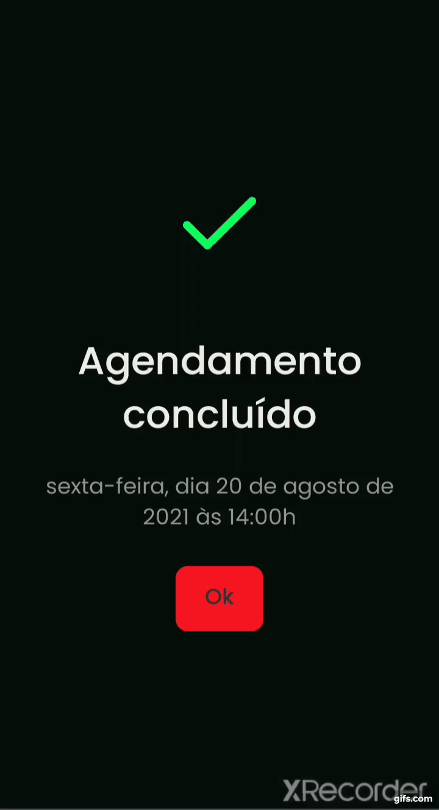

<h1 align="center">
  
</h1>

  <strong>
    🧠 PsyHeart Android/Iphone mobile app for people who need help. ❤️ 
    PsyHeart is a platform that allows you to schedule an online session with a psychologist. 
    🧠 * Keep your mind aligned with your heart! * ❤️
  </strong> Practical project for study Inspired by Rocketseat's GoBarber 

  

    Access the repository of the API version of PsyHeart at: https://github.com/Silvio-Ronaldo/psyheart-api 
    Access the repository for the Web version of PsyHeart at: https://github.com/Silvio-Ronaldo/psyheart-web 
  
 

  
  
  
  
  

<h2>
  📋 Table of contents
</h2>
<ul>
  <li><a href="https://github.com/Silvio-Ronaldo/psyheart-mobile#-status">Status</a></li>
  <li><a href="https://github.com/Silvio-Ronaldo/psyheart-mobile#-how-it-works">How it works</a></li>
  <li><a href="https://github.com/Silvio-Ronaldo/psyheart-mobile#-its-paid">It's paid?</a></li>
  <li><a href="https://github.com/Silvio-Ronaldo/psyheart-mobile#%EF%B8%8F-demonstration">Demonstration</a></li>
  <li><a href="https://github.com/Silvio-Ronaldo/psyheart-mobile#-upcoming-features">Upcoming features</a></li>
  <li><a href="https://github.com/Silvio-Ronaldo/psyheart-mobile#%EF%B8%8F-technologies">Technologies</a></li>
  <li><a href="https://github.com/Silvio-Ronaldo/psyheart-mobile#-author">Author</a></li>
  <li><a href="https://github.com/Silvio-Ronaldo/psyheart-mobile#%EF%B8%8F-license">License</a></li>
</ul> 

<h2>📌 Status</h2>
<h4 align="center">🚧 PsyHeart mobile app is in development. 🚀</h4> 

<h2>🤔 How it works</h2>

PsyHeart's mobile app is designed for both Android and Iphone devices.

Unlike the web platform, the mobile app is for regular users who feel the need to seek help from psychologists.

In these chaotic times, many people don't know how to find help for mental health. With PsyHeart all you have to do is register quickly, choose an available professional, schedule a time and be done!

Quick and easy, because mental health is no frills. Mental health is important!
 

<h2>💲 It's paid?</h2>

Not! PsyHeart's proposal is to provide free care to help those in need most in these times of calamity.

Facilitating access to psychology professionals, must consider the target audience we want to help. That's why PsyHeart is free.

Remember, PsyHeart is not an employer. It's just a bridge to help in times of crisis. We do not replace traditional psychology offices or medium/long term treatments.

When scheduling a conversation with a psychologist, remember, we will not charge you for anything. Within PsyHeart there are no charges. However, any practice, treatment, consultation and other things outside the platform can be charged by the professional. Chat and ask your questions.
 

<h2>🖥️ Demonstration</h2>
<h3>New Appointment</h3>
  

    
  
 
  
<h3>Profile</h3>
  

    
  
 
  

<h2>📆 Upcoming features</h2>

Soon, PsyHeart will have the functionality of online assistance, with video calling.
 

<h2>🛡️ Technologies</h2>

The main tools used in the development of the PsyHeart mobile app: 

<ul>
  <li><a href="https://reactnative.dev">React Native</a></li>
  <li><a href="https://www.typescriptlang.org">TypeScript</a></li>
  <li><a href="https://styled-components.com">Styled Components</a></li> 
 
  <li><a href="https://react-native-async-storage.github.io/async-storage/docs/usage/">React Native Async Storage</a></li>
  <li><a href="https://github.com/react-native-datetimepicker/datetimepicker">React Native Datetime Picker</a></li>
  <li><a href="https://github.com/react-native-image-picker/react-native-image-picker">React Native Image Picker</a></li>
  <li><a href="https://unform.dev">Unform</a></li>
  <li><a href="https://github.com/jquense/yup">Yup</a></li> 
  
  <li><a href="https://testing-library.com">Testing-library</a></li>
  <li><a href="https://jestjs.io/pt-BR/">Jest</a></li> 
  
  <li><a href="https://eslint.org">ESLint</a></li>
  <li><a href="https://prettier.io">Prettier</a></li>
  <li><a href="https://editorconfig.org">EditorConfig</a></li>
</ul> 

<h2>👽 Author</h2>
<table>
  <tr>
    <td align="center"><a href="https://github.com/Silvio-Ronaldo"> <b>Silvio Ronaldo</b></a> <a href="https://github.com/Silvio-Ronaldo" title="Silvio Ronaldo">🍀</a></td>
  </tr>
</table>

Leave your star, fork the project or open a pull request ❤️

Contact me on social networks: 

 

<h2>⚖️ License</h2>

<strong>PsyHeart mobile app is MIT licensed, as found in the <a href="./LICENSE">LICENSE file</a>.</strong>

